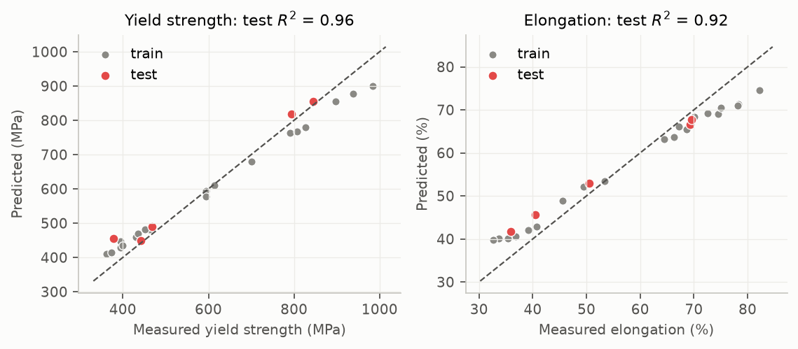
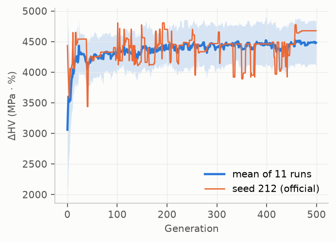
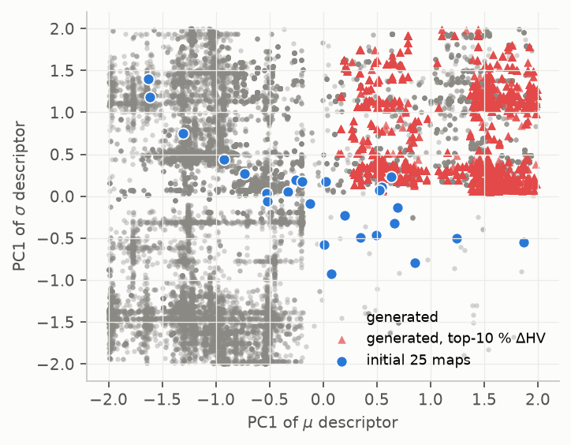
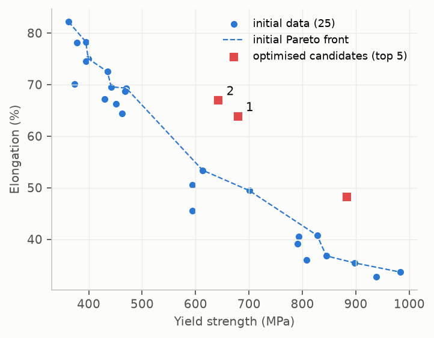

# 论文复刻：Generative design of high-fidelity microstructures using physics-aware machine learning

> Liao W., Li K., Tang B., …, Li J., Yuan R. *Nature Communications* (2026), doi:[10.1038/s41467-026-78118-3](https://doi.org/10.1038/s41467-026-78118-3)
> 官方代码：[nwpuai4msegroup/microstructures_design](https://github.com/nwpuai4msegroup/microstructures_design)（MIT）

本目录用 PyTorch / scikit-learn 从零重写了论文的整条流程：**物理感知损失的 VAE + 条件 DDPM 生成 EBSD 微观组织 → 潜空间描述子 + PCA → GBR 代理模型 → NSGA-II 多目标逆向设计 → ΔHV 追踪 → 解码生成新组织 → 晶粒统计 / 双峰分析 → 力学"虚拟验证"**。结果分两部分：

* **Part A（真实数据，精确复现 Fig. 4b–f）**：用作者公开的 25 组 IN625 实测性能、作者训练好的 VAE 所编码的 2000×128 潜变量，以及作者保存的 GBR 模型，逐项复现代理模型精度、NSGA-II 优化、ΔHV 曲线和 Pareto 候选。并额外做了稳健性检验。
* **Part B（合成数据，跑通生成模型全链路）**：原始 25 张 EBSD 大图和作者的 VAE 权重都拿不到（见 §3），所以写了一个基于物理冶金规律的 IN625 EBSD Euler 图合成器，外加一个平均场晶体塑性代理模型（替代 CPFE）。在这套数据上完整训练 VAE / DDPM，复现 Fig. 2、Fig. 3、Fig. 4、Fig. 5 和补充图的分析流程。

---

## 1. 论文方法速览

| 步骤 | 论文做法（正文 + Methods + 官方代码） |
|---|---|
| 数据 | Inconel 625，热轧压下量 0–50 % × 热处理 650–1050 °C × 1–20 h 的 25 组正交工艺；EBSD Euler 图 800×1000 px，步长 0.5 µm；拉伸得到屈服强度 / 延伸率 |
| 数据扩充 | 每张大图均匀切成 8×10 = 80 块 100×100 → 2000 块；翻转 / 旋转 ×6 → 12 000；模糊 / 仿射畸变 / 黑块 / 腐蚀 / 膨胀 ×5 → 60 000（作为"修复"训练的输入，目标为原图）；共 72 000；按原图 80/20 划分 |
| 物理感知损失 | L = L<sub>pix</sub>（MAE）+ L<sub>edge</sub>（Sobel，强调晶界）+ L<sub>SSIM</sub>（取向结构）+ L<sub>KL</sub> |
| 生成模型 | VAE（3 层卷积 / 3 层反卷积，128 维潜变量，输入缩放到 128 px）+ 以 VAE 输出为条件的 DDPM（U-Net 预测噪声，20 步 DDIM 采样）；Adam，余弦退火 1e-4→0，100 epoch，batch 50 |
| 潜空间描述子 | 每张图 80 块的潜变量逐维求均值 μ 与标准差 σ（各 128 维）→ 分别 PCA 取前 3 个主成分 → 6 维 |
| 代理模型 | GBR（RandomizedSearchCV 搜 n_estimators∈[10,500]、max_depth∈[1,20] 等），测试集 R² > 0.92 |
| 逆向设计 | NSGA-II，种群 10，500 代，变量范围 [-2,2]⁶，同时最大化 YS 与 EL；ΔHV<sub>t</sub> = HV<sub>t</sub> − HV<sub>0</sub>（Eq. 16） |
| 生成 | 最优 6 维向量 → 逆 PCA 得 μ、σ → 采样 80 个 z ~ N(μ, σ²) → VAE 解码 → DDPM 细化 |
| 验证 | CPFE（{111}〈110〉滑移、位错密度硬化、晶界强化、损伤；GND 由 ResNet-18 预测）+ 实验（1000 °C/60 % 热轧 + 850 °C/5 min，双峰晶粒组织） |

## 2. 复刻内容对照

| 论文模块 | 本仓库实现 | 文件 | 状态 |
|---|---|---|---|
| Euler 角 ↔ RGB 映射 | 从官方示例图反推出 Channel 5 立方晶系约定：R=φ1/360°、G=Φ/90°、B=φ2/90°（Φ ≤ 54.7°，与示例图 G 通道最大值 ≈155 吻合） | `msdesign/euler.py` | ✅ |
| 数据切块与三步扩充 | 与官方 `Function.py` 中的 cv2 算子一一对应（5×5 σ=5 高斯模糊、同一组仿射点对、3 个 20×20 黑块、2×2 腐蚀 / 膨胀） | `msdesign/data.py` | ✅ |
| L<sub>pix</sub>、L<sub>edge</sub>、L<sub>SSIM</sub>、KL（Eq. 1–11） | 按公式实现 | `msdesign/losses.py` | ✅ |
| VAE 结构 | 与官方 `SigmaVAE` 完全一致 | `msdesign/models.py` | ✅ |
| 条件 DDPM | 与官方结构一致（offset-cosine 连续噪声调度，12 通道输入 U-Net，20 步 DDIM）；**官方 `diffusVAE.pt` 可严格加载进本实现**，结构一致性已验证；训练损失按 Eq. 15 | `msdesign/models.py` | ✅ |
| 物理特征提取（Fig. 3） | 由黑色晶界网络分割晶粒 → 面积、等效椭圆长 / 短轴、三个 Euler 角；邻晶取向差（含立方对称）；KAM | `msdesign/features.py` | ✅ |
| 描述子 + 可逆 PCA | 同官方 notebook，并固定 PCA 符号约定（见 §5.3） | `msdesign/inverse.py` | ✅ |
| GBR + 随机搜索 | 同官方 notebook（同样的搜索空间、cv=5、n_iter=50、划分种子 75 / 98） | `msdesign/inverse.py` | ✅ |
| NSGA-II | 自写实现，算子与 pymoo 默认值一致（SBX η=15、PM η=20、二元锦标赛、拥挤度），可记录每一代 | `msdesign/nsga2.py` | ✅ |
| ΔHV（Eq. 16） | 按公式实现 | `msdesign/inverse.py` | ✅ |
| Wasserstein 代表块筛选（Supp. Note 6） | 同官方 notebook | `msdesign/inverse.py` | ✅ |
| 25 张 EBSD 原图 | **未公开** → 用物理冶金合成器生成（JMAK 再结晶、回复、晶粒长大、Σ3 退火孪晶、轧制拉长与取向梯度、1 px 黑色晶界、EBSD 噪声） | `msdesign/synthetic.py` | ⚠️ 替代 |
| CPFE 验证 | **无法在 CPU 上做全场 CPFE，补充材料中的参数也拿不到** → 平均场晶体塑性代理：逐晶粒 Schmid / Sachs 因子、Hall-Petch、KAM→GND 初始位错密度、Kocks-Mecking-Estrin 演化、异构界面 (HDI) GND 项、Taylor 等应变均匀化、Considère 判据 | `msdesign/cp_proxy.py` | ⚠️ 替代 |
| ResNet-18 GND 预测 | 用 KAM 换算 GND（ρ = 2θ/(u·b)）替代 | `msdesign/cp_proxy.py` | ⚠️ 替代 |
| 基线 WGAN / 标准 DDPM（Supp. Fig. 7） | 未实现（只做了与论文 Fig. 2 相同的"仅 L<sub>pix</sub>"消融） | — | ❌ |
| 实验合成验证 | 无法复现 | — | ❌ |

## 3. 数据可得性

| 数据 | 来源 | 本仓库 |
|---|---|---|
| 25 组工艺与 YS / EL 实测值（Supp. Table 1） | 官方仓库 `dataset.csv` | `data/official/dataset.csv` |
| 2000 块切片的 128 维潜变量（作者训练好的 VAE 编码） | 官方仓库 `z_i.csv` | `data/official/z_i.csv` |
| 10 块 100×100 EBSD 示例切片 | 官方仓库 `examples/` | `data/official/examples/` |
| 作者的 GBR 模型（sklearn 0.23 pickle） | 官方仓库 `model_save/GBR_*.pkl` | 导出为可移植的 `data/official/gbr_official_trees.npz`（`scripts/export_official_gbr.py`） |
| 作者的 DDPM 权重 `diffusVAE.pt` | 官方仓库 | 未拷贝（7.9 MB）；已验证能严格加载进 `msdesign.models.Diffusion` |
| 作者的 VAE 权重 | Google Drive（本运行环境网络策略禁止访问） | ❌ 缺失，所以 Part A 的最优潜变量无法解码成图像；`results/official/optimized_latents.npz` 已给出 80×128 潜变量，拿到 VAE 权重后可直接解码 |
| 25 张 800×1000 EBSD 原图、补充材料（CPFE 参数等） | 未公开 / nature.com 无法访问 | ❌ |

官方数据的版权与许可见 `data/official/LICENSE_official_repo`（MIT）。

## 4. 快速开始

```bash
pip install -r requirements.txt

# Part A：官方数据上的逆向设计（约 6 分钟，CPU）
python3 scripts/inverse_design_official.py            # --surrogate official|gbr|gpr

# Part B：合成数据全流程（4 核 CPU 约 3 小时）
bash run_quick.sh

# 按论文的完整设置（800×1000、100 px→128 px、72 000 对/epoch、100 epoch），需 GPU
bash run_paper_gpu.sh
```

| 脚本 | 作用 | 对应论文 |
|---|---|---|
| `scripts/inverse_design_official.py` | Part A | Fig. 4b–f |
| `scripts/make_synthetic_dataset.py` | 生成 25 张合成 Euler 图 + 代理模型标签 + 20/5 划分 | Supp. Fig. 1 / Table 1 |
| `scripts/train_vae.py --loss full/pix` | 物理感知 VAE / 仅像素损失基线 | Fig. 2a,b |
| `scripts/train_ddpm.py` | 条件 DDPM 细化器 | Fig. 1a |
| `scripts/analyze_fidelity.py` | 重建对比、六特征保真度、取向差分布、潜空间插值 / 外推 | Fig. 2c、Fig. 3、Supp. Fig. 4/6/8 |
| `scripts/inverse_design_synthetic.py` | 闭环逆向设计、解码、晶粒尺寸分布、虚拟验证、PCA 维数研究 | Fig. 4、Fig. 5、Supp. Fig. 10/14 |
| `scripts/export_official_gbr.py` | 把作者的 sklearn 0.23 pickle 导出为可移植格式（需 sklearn 1.2.x 环境） | — |

## 5. Part A：用官方数据复现逆向设计（Fig. 4b–f）

输入：`z_i.csv`（作者 VAE 编码的 25×80 个 128 维潜变量）+ `dataset.csv`（实测 YS / EL）。

### 5.1 代理模型（Fig. 4b, c）



| | 论文 / 官方 notebook | 本复现（作者保存的 GBR） | 同一套超参数的留一法 CV | 用同样的随机搜索在 20 个随机划分上重新拟合（测试 R² 中位数） |
|---|---|---|---|---|
| 屈服强度 | 训练 0.963 / 测试 0.961 | **0.963 / 0.961** | 0.23 | 0.17（IQR −0.39…0.48，0/20 次 > 0.92） |
| 延伸率 | 训练 0.929 / 测试 0.922 | **0.929 / 0.922** | 0.29 | 0.21（IQR −0.61…0.49，0/20 次 > 0.92） |

* 作者保存的模型在同一描述子上**逐位复现**了论文数值，说明描述子（均值 / 标准差 → PCA 3+3）的计算与原作一致。
* **稳健性提醒**：测试集只有 5 个合金。作者保存的 `RandomizedSearchCV` 对象里记录的内部交叉验证 R²（YS 为 4 折，EL 为 5 折）只有 **0.10（YS）和 −0.69（EL）**；用同一套超参数做留一法 CV 只有 0.23 / 0.29；按官方 notebook 流程在其它随机划分上重新搜索，测试 R² 的中位数约 0.2，20 次里没有一次达到 0.92（`results/official/surrogate_split_robustness.png`）。所以论文报告的 R² > 0.92 很大程度上取决于"种子 75 / 98"这组有利的划分，不宜当作泛化精度来理解。
* 另一个细节：从树的初始常数可以反推出，作者的 EL 模型实际上是在**种子 75** 的训练集上拟合的，而 notebook 用**种子 98** 的划分评估它（5 个"测试"样本里有 3 个其实在训练集中）。在它真正留出的 5 个样本上 R² = 0.925，与报告值接近，所以不影响结论，这里只作记录。
* scikit-learn ≥ 1.5 修改了 PCA 的 `svd_flip` 符号约定，会把 μ 描述子第 3 主成分的符号翻转，导致作者的树模型在该轴上失效（R² 从 0.963 掉到 0.956）。`DescriptorPCA` 显式恢复了旧约定。

### 5.2 NSGA-II 与 ΔHV（Fig. 4d–f）

| ΔHV 曲线 | 生成解在 PC 空间的位置 | 最终候选 |
|---|---|---|
|  |  |  |

* 参考点 = 原始数据的最小值 (362.26 MPa, 32.69 %)，HV<sub>0</sub> = 2620 MPa·%。种子 212（官方 notebook 所用）的最终 ΔHV = 4678；11 个种子平均为 4483 ± 361。
* 论文中 ΔHV 约在 150 代后进入平台；本复现约 **19 代**就达到最终值的 95 %。原因是 GBR 是分段常数函数，在 6 维盒子里很快就能找到最优叶子组合，之后的波动来自拥挤度替换。
* 最优的不同候选：**① 679 MPa / 63.8 %**，**② 643 MPa / 66.9 %**，另有 883 MPa / 48.2 %，均位于原始 Pareto 前沿之外（强度-塑性协同），与论文 Fig. 4f 的结论一致。几乎所有生成解（99.9 %）都落在 25 张原图的 PC 包络之外（Fig. 4e）。
* 需要注意：GBR 无法外推，预测值不会超过训练集中最大的 YS / EL，所以"超出前沿"来自已有叶子值的新组合，并不是真正的外推。
* 最优候选的 80×128 潜变量和 Wasserstein 代表块编号保存在 `results/official/optimized_latents.npz`。拿到作者的 VAE 权重后，`msdesign.pipeline.decode` 可以直接把它们解码成组织图。

<!-- RESULTS_B -->

## 7. 与论文的差异与局限（务必阅读）

1. **训练数据不是真实 EBSD**。Part B 的 25 张图由 `msdesign/synthetic.py` 生成。它按论文的 25 组工艺，用 JMAK 再结晶 + 回复 + 晶粒长大的简化模型确定组织状态，再渲染成 Euler 图，外观与统计量接近真实 IN625（见 `results/synthetic/synthetic_maps.png`），但**不是**论文的数据。Part B 的数值结论只能说明"方法在这类数据上是否有效"，不能与论文逐数对比。
2. **CPFE → 平均场晶体塑性代理**。代理模型用逐晶粒的取向、尺寸和 KAM 位错密度，可以对"晶粒细化 / 位错储存 / 双峰异构"给出定性正确的响应。它在 25 组合成图上的 YS / EL 与论文实测值的相关系数为 0.97 / 0.96，但它没有全场应力应变分配，也没有损伤模型，参数只是量级估计。
3. **计算量**：CPU 快速预设（64 px 切片、每 epoch 抽 9 600 对、VAE 20 epoch、DDPM 12 epoch）的优化步数约为论文的 1/30，所以学习率提高到 1e-3（VAE）/ 5e-4（DDPM）；按论文设置请用 `run_paper_gpu.sh`（100 px→128 px、72 000 对 / epoch、100 epoch、lr 1e-4）。
4. **KL 项的归一化**：论文 Eq. 11 各项等权相加，没有说明归一化方式。本实现把 KL（对 128 维求和）除以图像元素数，与逐元素平均的重建损失处于同一量级（等价于逐元素 ELBO），可用 `--kl-weight` 调整。官方 notebook 加载的是 σ-VAE（`optimal_sigma_vae`）的权重，但训练代码未公开。
5. **DDPM 损失**：按论文 Eq. 15，在预测噪声与真实噪声之间计算 L<sub>pix</sub> + L<sub>SSIM</sub> + L<sub>edge</sub>。高斯噪声的 Sobel 响应很大，L<sub>edge</sub> 在该损失中占主导。
6. **"GBR" 的歧义**：论文 Results 部分写作 "Gaussian process regression (GBR)"，Methods 和官方代码都是 Gradient Boosting Regression。本仓库默认用 GBR（Gradient Boosting），`--surrogate gpr` 可切换到高斯过程作对照。
7. **未复现**：WGAN / 标准 DDPM 基线（Supp. Fig. 7）、Inception-v3 FD 指标、实验合成验证、ResNet-18 GND 模型（以 KAM 代替）。

## 8. 用你自己的 EBSD 数据

1. 把每张 Euler 图导出为 RGB（R=φ1/360°，G=Φ/90°，B=φ2/90°，立方晶系约化区，晶界画成黑色；与 Channel 5 默认导出一致），尺寸为 8×patch 行、10×patch 列。
2. 仿照 `scripts/make_synthetic_dataset.py` 保存 `dataset.npz`：`images`（uint8，N×H×W×3）、`props`（N×2：YS, EL）、`train_idx`、`test_idx`、`pixel_um`、`patch`。
3. 依次运行 `train_vae.py → train_ddpm.py → analyze_fidelity.py → inverse_design_synthetic.py`（传 `--data/--work` 指向你的目录）。`inverse_design_synthetic.py` 中的"虚拟验证"用的是 `cp_proxy`，换成真实数据后请改用你自己的 CPFE / 实验结果。

## 9. 引用与许可

复刻代码按 MIT 许可提供。`data/official/` 下的文件来自官方仓库（MIT，© 2026 Weijie Liao）。论文正文为 CC BY-NC-ND 4.0，本仓库不包含论文原文或图片。使用时请引用原论文：

```bibtex
@article{liao2026generative,
  title   = {Generative design of high-fidelity microstructures using physics-aware machine learning},
  author  = {Liao, Weijie and Li, Kaidi and Tang, Bin and Fan, Jiangkun and Wang, Jun and Xue, Xiangyi and Li, Jinshan and Yuan, Ruihao},
  journal = {Nature Communications},
  year    = {2026},
  doi     = {10.1038/s41467-026-78118-3}
}
```
